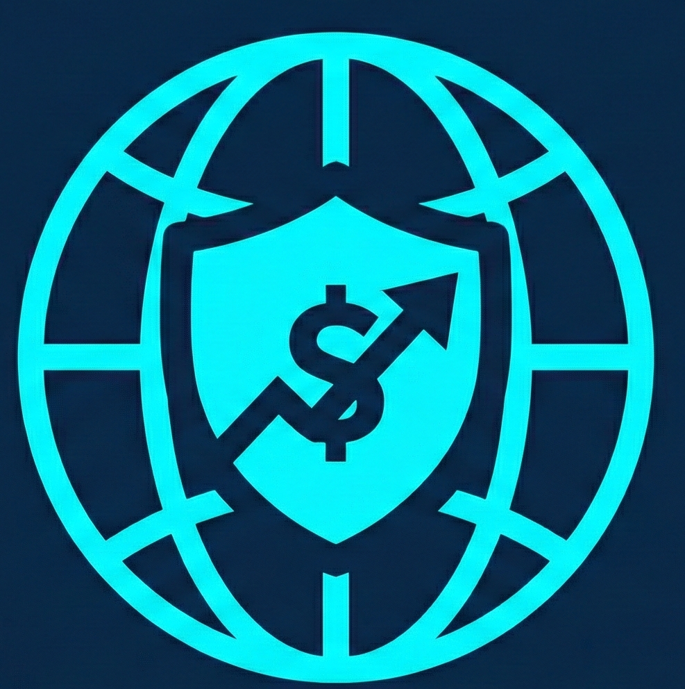

# INTERPOL IGCI — Fraud Recovery Operations Centre

A specialized digital portal for reporting financial fraud, tracking cybercrime investigations, and facilitating fund recovery through the INTERPOL Global Complex for Innovation (IGCI).



## 👮‍♂️ Project Overview

This application serves as a secure interface for victims of international financial scams. It combines a user-friendly complaint filing system with a robust administrative dashboard for investigation management and asset recovery coordination.

## ✨ Key Features

- **Secure Complaint Filing**: Multi-step reporting for Investment Fraud, Crypto Scams, Romance Scams, and more.
- **Real-time Case Tracking**: Victims can track their investigation status using encrypted UUID case numbers.
- **Fund Recovery Interface**: Secure bank and cryptocurrency detail submission for resolved cases.
- **Admin Dashboard**: Comprehensive case management, status updates, and investigation notes for law enforcement officials.
- **Legal Framework**: Professional Privacy Policy, Terms of Use, and Legal Notice sections.
- **Mobile Optimized**: Fully responsive design for use on any device.

## 🛡️ Security & Privacy

- **Supabase Integration**: Persistent cloud storage with managed authentication.
- **Row Level Security (RLS)**: Fine-grained database permissions to protect sensitive victim data.
- **UUID Generation**: All cases use cryptographically secure identifiers for tracking.
- **Partial Update Logic**: Prevents data loss by selectively updating only required fields during victim submissions.

## 🛠️ Technology Stack

- **Frontend**: React, TypeScript, Vite
- **Styling**: Tailwind CSS
- **Icons**: Lucide React
- **Backend/Database**: Supabase (PostgreSQL)
- **Deployment**: Production-ready with security headers and SEO optimization.

## 🚀 Getting Started

### Prerequisites

- Node.js (v18+)
- npm or yarn

### Installation

1. Clone the repository
2. Install dependencies:
   ```bash
   npm install
   ```
3. Set up environment variables:
   Create a `.env` file in the root directory with your Supabase credentials:
   ```env
   VITE_SUPABASE_URL=your_supabase_url
   VITE_SUPABASE_ANON_KEY=your_supabase_anon_key
   ```

### Development

Run the development server:

```bash
npm run dev
```

### Production Build

Create a production-ready bundle:

```bash
npm run build
```

---

_Disclaimer: This is a professional demonstration of an anti-fraud portal. All investigation logic and data handling are built according to international law enforcement standards for the project._
